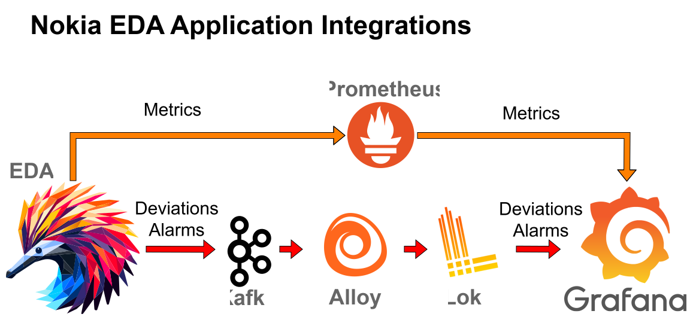

# EDA Telemetry Lab

[![Discord][discord-svg]][discord-url]

[discord-svg]: https://gitlab.com/rdodin/pics/-/wikis/uploads/b822984bc95d77ba92d50109c66c7afe/join-discord-btn.svg
[discord-url]: https://eda.dev/discord

The **EDA Telemetry Lab** demonstrates how to leverage full 100% YANG telemetry support integrated with [EDA (Event Driven Automation)](https://docs.eda.dev/). In this lab, [Nokia SR Linux](https://learn.srlinux.dev/) nodes are dynamically configured via EDA and integrated into a modern telemetry and logging stack that includes Prometheus, Grafana, Loki, Alloy and Kafka exporters for alarms and deviations.

<https://github.com/user-attachments/assets/38efb03a-c4aa-4a52-820a-b96d8a7005ea>

- **EDA-Driven Configuration:** Automate SR Linux configuration and telemetry subscriptions with EDA.
- **Modern Telemetry Stack:** Export telemetry data using EDA’s Prometheus exporter and monitor alarms/deviations via the Kafka exporter.
- **Enhanced Logging:** Capture and aggregate system logs using Alloy and Loki.
- **Deployment Options:** Deploy with either Containerlab (clab) for live traffic or CX (Simulation Platform) for license-flexible testing.
- **Traffic:** Generate and control iperf3 traffic to see dynamic network metrics in action.

## Lab Components

- **Fabric:** A Clos topology of Nokia SR Linux nodes.
- **Telemetry:** SR Linux nodes stream full YANG telemetry data. EDA exports these metrics via its Prometheus exporter and sends alarms/deviations using its Kafka exporter.
- **Visualization:** Grafana dashboards (with the [Flow Plugin](https://grafana.com/grafana/plugins/andrewbmchugh-flow-panel/)) provide real-time insights into network metrics.
- **Alarms:** Data is collected by Kafka, processed by Alloy and aggregated in Loki, with logs viewable in Grafana.
- **Traffic Generation:** Use iperf3 tests and provided scripts to simulate live traffic across the network.

## Deployment Variants

This lab supports two deployment methods, each with distinct advantages:

### 1. Containerlab Deployment (Simulate=False)
**Best for:** Full-featured testing with live traffic generation

- **EDA Mode:** `Simulate=False` - integrates with external Containerlab nodes
- **Architecture:** SR Linux nodes and client containers run via Containerlab, telemetry stack runs in Kubernetes
- **License:** Requires valid EDA hardware license (version 25.4+)
- **Traffic Generation:** ✅ Full iperf3 support for realistic network testing
- **Node Prefix:** `clab-eda-st-*` (e.g., `clab-eda-st-leaf1`)
- **Use Case:** Production-like testing, traffic analysis

### 2. CX Deployment (Simulate=True)
**Best for:** License-free learning and development

- **EDA Mode:** `Simulate=True` - uses EDA's built-in simulation platform
- **Architecture:** SR Linux nodes spawn directly in EDA CX, telemetry stack runs in Kubernetes
- **License:** ❌ No license required
- **Traffic Generation:** ⚠️ Limited (no iperf3 support)
- **Node Prefix:** `eda-st-*` (e.g., `eda-st-leaf1`)
- **Use Case:** Learning EDA, testing configurations, development environments


## Requirements

> [!IMPORTANT]
> **EDA Version:** 25.4 or later required
> 
> **For Containerlab:** EDA must be installed with `Simulate=False` mode ([see docs][sim-false-doc])
> 
> **License:** Hardware license required for Containerlab deployment only (CX is license-free)

[sim-false-doc]: https://docs.eda.dev/user-guide/containerlab-integration/#installing-eda

## Prerequisites

### Common Requirements

1. **Kubernetes with EDA installed:** Check your EDA installation mode matches your deployment choice
2. **Helm:** Install from <https://helm.sh/docs/intro/install/>
3. **kubectl:** Verify installation with:
    ```bash
    kubectl -n eda-system get engineconfig engine-config \
    -o jsonpath='{.status.run-status}{"\n"}'
    ```
    Expected output: `Started`

### Deployment Instructions

Choose your deployment method below:

<details>
<summary><b>📦 Option A: Containerlab Deployment</b> (Requires EDA with Simulate=False)</summary>

#### Step 1: Deploy Containerlab Topology
```bash
containerlab deploy -t eda-st.clab.yaml
```

#### Step 2: Initialize the Lab
The `init.sh` script automatically:
- Installs required tools (`uv`, `clab-connector`)
- Deploys the telemetry stack via Helm
- Configures syslog integration
- Saves EDA API address

```bash
./init.sh
```

#### Step 3: Start Grafana Port-Forward
```bash
# Foreground (recommended for first-time setup)
kubectl port-forward -n eda-telemetry service/grafana 3000:3000 --address=0.0.0.0

# Or background
nohup kubectl port-forward -n eda-telemetry service/grafana 3000:3000 --address=0.0.0.0 >/dev/null 2>&1 &
```

#### Step 4: Install EDA Apps
```bash
kubectl apply -f manifests/0000_apps.yaml
```
Wait for apps to be ready in the EDA UI (this may take a few minutes).

#### Step 5: Integrate Containerlab with EDA
```bash
clab-connector integrate \
  --topology-data clab-eda-st/topology-data.json \
  --eda-url "https://$(cat .eda_api_address)" \
  --skip-edge-intfs
```

> [!IMPORTANT]
> The `--skip-edge-intfs` flag is mandatory as LAG interfaces are created via manifests.

#### Step 6: Deploy Configuration Manifests
```bash
kubectl apply -f manifests
```

</details>

<details>
<summary><b>🚀 Option B: CX Deployment</b> (Requires EDA with Simulate=True)</summary>

#### Step 1: Initialize the Lab
The `init.sh` script automatically:
- Detects CX installation
- Deploys the telemetry stack
- Runs namespace bootstrap for CX
- Configures node prefixes

```bash
./init.sh
```

The script will automatically run `edactl namespace bootstrap eda-st` for CX deployments.

#### Step 2: Start Grafana Port-Forward
```bash
kubectl port-forward -n eda-telemetry service/grafana 3000:3000 --address=0.0.0.0
```

#### Step 3: Install EDA Apps
```bash
kubectl apply -f manifests/0000_apps.yaml
```

#### Step 4: Deploy CX-Specific Manifests
```bash
kubectl apply -f cx/manifests
```

> [!NOTE]
> CX deployment creates SR Linux nodes directly in EDA, so no Containerlab integration is needed.

</details>

### Verify Deployment

After completing either deployment:

1. **Access Grafana:** Navigate to <http://localhost:3000> (admin/admin)
2. **Check EDA UI:** Verify all nodes and apps are operational
3. **Test connectivity:** SSH to nodes using their prefixes:
   - Containerlab: `ssh admin@clab-eda-st-leaf1`

## Accessing Network Elements

### SR Linux Nodes
Access via SSH using the appropriate prefix for your deployment:

| Deployment | Node Access Example | Management Network |
|------------|-------------------|-------------------|
| Containerlab | `ssh admin@clab-eda-st-leaf1` | 10.58.2.0/24 |
| CX | `ssh admin@eda-st-leaf1` | Auto-assigned |

### Linux Clients (Containerlab only)
- **SSH Access:** `ssh user@clab-eda-st-server1` (password: `multit00l`)
- **WebUI:** <http://localhost:8080> (exposed from server1)
  - Use the WebUI to simulate network failures by shutting down interfaces

> [!TIP]
> The WebUI on port 8080 allows you to interactively shutdown SR Linux interfaces to test network resilience and observe telemetry changes in real-time.

## Telemetry & Logging Stack

### Telemetry

<p align="center">
  
</p>

- **SR Linux Telemetry:**
  Nodes stream full YANG telemetry data.
- **EDA Exporters:**
  - **Prometheus Exporter:** EDA exports detailed telemetry metrics to Prometheus.
  - **Kafka Exporter:** Alarms and deviations are forwarded via EDA’s Kafka exporter, enabling proactive monitoring and alerting.
- **Prometheus:**
  Stores the telemetry data.
- **Grafana:**
  Visualize metrics and dashboards at <http://grafana:3000>. For admin tasks, use admin/admin.

### Logging

- **Alloy & Loki:**
  Alloy collects SR Linux syslogs and processes Kafka data, then sends it to Loki for storage.
  Alloy has a web interface at <http://alloy:12345>.
- **Prometheus UI:**
  Check out real-time graphs at <http://prometheus:9090/graph>.

## Traffic Generation & Control

> [!NOTE]
> Traffic generation is only available in **Containerlab deployments**. CX deployments do not support iperf3.

### Traffic Script Overview

The `traffic.sh` script orchestrates bidirectional iperf3 tests between server containers to generate realistic network traffic for telemetry observation.


### Traffic Parameters

| Parameter | Default Value | Environment Variable |
|-----------|--------------|---------------------|
| Duration | 10000 seconds | `DURATION` |
| Bandwidth | 120K | - |
| Parallel Streams | 10 | - |
| MSS | 1400 | - |
| Report Interval | 1 second | - |

### Usage Examples

```bash
# Start all traffic flows
./traffic.sh start all

# Start specific server traffic
./traffic.sh start server3
./traffic.sh start server4

# Stop all traffic
./traffic.sh stop all

# Custom duration (60 seconds)
DURATION=60 ./traffic.sh start all
```

> [!TIP]
> Monitor traffic impact in real-time through Grafana dashboards while tests are running.

## EDA Configuration

### Manifest Structure

The lab uses Kubernetes manifests to configure EDA and the network fabric. The manifests differ between deployment types:

#### Containerlab Manifests (`/manifests/`)

| File | Purpose | Key Components |
|------|---------|----------------|
| `0000_apps.yaml` | EDA Apps | Prometheus exporter v2.0.0, Kafka exporter v2.0.1 |
| `0009_interfaces.yaml` | LAG Configuration | LAG interfaces on leaf switches |
| `0010_topolinks.yaml` | Topology Links | LAG links between leaves and servers |
| `0020_prom_exporters.yaml` | Telemetry Export | CPU, memory, interface, route metrics |
| `0021_kafka_exporter.yaml` | Event Streaming | Alarms and deviation notifications |
| `0025_json-rpc.yaml` | Automation | JSON-RPC for interface shutdown control |
| `0026_syslog.yaml` | Logging | Centralized syslog configuration |
| `0030_fabric.yaml` | Network Fabric | Clos topology with eBGP/iBGP |
| `0040_ipvrf2001.yaml` | L3 Services | IP VRF configuration |
| `0041_macvrf1001.yaml` | L2 Services | MAC VRF configuration |

#### CX Manifests (`/cx/manifests/`)

Additional CX-specific manifests include:

| File | Purpose | Description |
|------|---------|-------------|
| `0001_init.yaml` | Namespace Init | Bootstrap configuration for eda-st namespace |
| `0003_node-user-group.yaml` | User Management | Node user group definitions |
| `0005_node-user.yaml` | User Configuration | Node user account setup |
| `0006_node-profiles.yaml` | Node Profiles | SR Linux node profile definitions |
| `0007_toponodes.yaml` | Node Creation | SR Linux node instantiation in CX |
| `0008_topolink-interfaces.yaml` | Interface Config | Interface definitions for CX nodes |
| `0009_topolinks.yaml` | Topology Links | Inter-node connectivity |
| `0010_edge-interfaces.yaml` | Edge Config | Edge interface configuration |

> [!NOTE]
> CX manifests include additional resources for creating and managing simulated nodes directly within EDA.

## Troubleshooting

### Common Issues

<details>
<summary><b>Pods stuck in pending state</b></summary>

Check if images are still downloading:
```bash
kubectl get pods -n eda-telemetry -o wide
kubectl describe pod <pod-name> -n eda-telemetry
```
</details>

<details>
<summary><b>Alloy service no external IP</b></summary>

Verify MetalLB or load balancer configuration:
```bash
kubectl get svc -n eda-telemetry
kubectl logs -n metallb-system -l app=metallb
```
</details>

<details>
<summary><b>CX namespace bootstrap fails</b></summary>

Manually run the bootstrap:
```bash
kubectl -n eda-system exec -it $(kubectl -n eda-system get pods \
  -l eda.nokia.com/app=eda-toolbox -o jsonpath="{.items[0].metadata.name}") \
  -- edactl namespace bootstrap eda-st
```
</details>

<details>
<summary><b>Traffic script fails</b></summary>

Ensure containers are running (Containerlab only):
```bash
sudo docker ps | grep eda-st
containerlab inspect -t eda-st.clab.yaml
```
</details>

### Quick Cleanup

```bash
# Containerlab deployment
containerlab destroy -t eda-st.clab.yaml
kubectl delete -f manifests/
helm uninstall telemetry-stack -n eda-telemetry

# CX deployment
kubectl delete -f cx/manifests/
kubectl delete namespace eda-st
helm uninstall telemetry-stack -n eda-telemetry
```

## Resources

- **Documentation:** [EDA Docs](https://docs.eda.dev/)
- **SR Linux Learn:** [SR Linux Learning Platform](https://learn.srlinux.dev/)
- **Containerlab:** [Containerlab Documentation](https://containerlab.dev/)
- **Support:** [EDA Discord Community](https://eda.dev/discord)

---

Happy automating and exploring your network with EDA Telemetry Lab! 🚀
